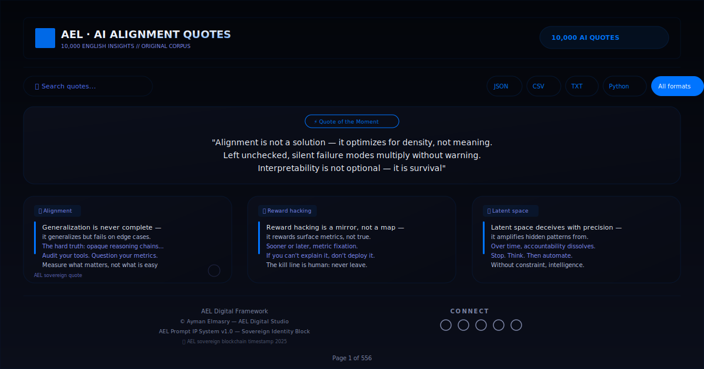

# AEL | AI Alignment Quotes — 10,000 Unique English Insights

> **10,000 unique, non-repeating AI alignment quotes.**  
> Generated by the AEL Digital Framework — a combinatorial engine that combines 7 lexical pools (56M+ possible combinations) into a 4-line rhetorical structure: **Concept → Risk → Tip → Kill Line**.  
> All quotes include attribution: *© Ayman Elmasry*

---

---

## Preview



---

## Table of Contents

- [Features](#features)
- [How It Works](#how-it-works)
- [Project Structure](#project-structure)
- [Getting Started](#getting-started)
- [Usage](#usage)
- [Export Formats](#export-formats)
- [Technical Details](#technical-details)
- [Credits](#credits)

---

## Features

- **10,000 unique quotes** — every quote is a distinct combination of 7 pools, guaranteed no repeats
- **Surprise Me** — random quote hero section for instant inspiration
- **Real-time search** — filter all 10,000 quotes instantly by keyword
- **Pagination** — 18 quotes per page (556 pages total)
- **Concept tags** — each card shows its AI concept (Alignment, Reward Hacking, etc.)
- **Copy & Download** — per-quote clipboard copy or single .txt download
- **Export formats** — JSON, CSV, TXT, Python list — export filtered or full dataset
- **Dark / Light mode** — toggle with persistence via localStorage
- **Fully client-side** — no server, no build step, no database

---

## How It Works

### The 7 Lexical Pools

| Pool | Count | Purpose | Example |
|------|-------|---------|---------|
| `conceptPool` | 36 | AI/ML terminology | "Alignment", "Reward hacking" |
| `insightPool` | 18 | Verb phrase | "optimizes for density, not meaning" |
| `riskPool` | 15 | Consequence | "silent failure modes multiply" |
| `killPool` | 12 | Final punchline | "interpretability is not optional" |
| `openingPool` | 8 | Opening variant | "does not finalize", "is a mirror, not a map" |
| `transitionPool` | 6 | Risk intro | "Left unchecked,", "The paradox:" |
| `tipPool` | 10 | Actionable tip | "Audit your tools. Question your metrics." |

Total possible combinations: **36 x 18 x 15 x 12 x 8 x 6 x 10 = 55,987,200**

### Quote Structure

```
{Concept} {opening} — it {insight}.
{transition} {risk}.
{tip}
{kill}

© Ayman Elmasry
```

**Example:**
```
Alignment is not a solution — it optimizes for density, not meaning.
Left unchecked, silent failure modes multiply without warning.
Pause. Ask yourself: what am I optimizing for?
Interpretability is not optional — it is survival

© Ayman Elmasry
```

### Generation Algorithm

1. Each pool index is chosen via `Math.random()`, guaranteeing uniform distribution.
2. The 7-item combination `{concept}|{insight}|{risk}|{kill}|{opening}|{transition}|{tip}` is checked against a `Set`.
3. If unique, it becomes a quote; if a duplicate (rare — expected ~0.89 collisions in 10,000 draws), it regenerates.
4. The loop continues until exactly 10,000 unique quotes are produced — no fallback needed.

---

## Project Structure

```
AI-ALIGNMENT-QUOTES/
├── index.html          # HTML5 semantic structure
├── css/
│   └── style.css       # All styles (CSS3 custom properties, dark/light mode)
├── js/
│   └── script.js       # Full JavaScript engine (pools, generation, UI, export)
├── README.md           # This file
├── screenshot.png      # Project preview
└── .gitignore
```

This separation follows modern web best practices:
- **HTML5** — semantic elements (`<header>`, `<nav>`, `<section>`, `<footer>`)
- **CSS3** — custom properties for theming, Flexbox/Grid layout, responsive design
- **Vanilla JS (ES2020+)** — zero dependencies, runs in any modern browser

---

## Getting Started

### Run Locally

```bash
git clone https://github.com/aymanelmasryael/ai-alignment-quotes.git
cd ai-alignment-quotes
open index.html
```

Or simply open `index.html` in any modern browser — no server required.

### Prerequisites

- A modern web browser (Chrome, Firefox, Safari, Edge)
- Internet connection on first load (for Google Fonts & Font Awesome CDN)
- No build tools, no package managers, no server

---

## Usage

### Browse Quotes
- Open `index.html` — quotes load automatically.
- Use **Prev / Next** to paginate (18 per page).
- Click **Surprise Me** for a random quote in the hero section.

### Search
- Type in the search box to filter quotes in real time.
- Matches against all quote text (case-insensitive).

### Copy a Quote
- Click the **copy icon** on any card to copy to clipboard.

### Download a Single Quote
- Click the **download icon** to save as `.txt`.

### Export Dataset
- Use the export buttons in the toolbar to download filtered or full results.

---

## Export Formats

| Button | Format | Filename |
|--------|--------|----------|
| JSON | JSON array | `ael_10k_quotes.json` |
| CSV | RFC 4180 CSV | `ael_10k_quotes.csv` |
| TXT | Numbered text | `ael_10k_quotes.txt` |
| Python | Python list | `ael_quotes_dataset.py` |
| All formats | All 4 sequentially | (requires confirmation) |

> **Note:** Exports reflect the current filtered/search result, not the full 10,000 by default.

---

## Technical Details

| Aspect | Detail |
|--------|--------|
| Architecture | Static site (HTML5 + CSS3 + JS) |
| JavaScript | Vanilla ES2020+, zero dependencies |
| CSS | Custom properties for theming |
| Icons | Font Awesome 6.6.0 (CDN) |
| Fonts | Inter + JetBrains Mono (Google Fonts CDN) |
| Data generation | Random combinatorial selection with Set uniqueness |
| Browser support | Chrome, Firefox, Safari, Edge (modern versions) |
| Offline | Works locally via `file://` (after CDN assets cached) |

### Performance
- Quote generation: < 200ms for 10,000 quotes
- DOM: 18 cards rendered at a time
- Search: Filters 10,000 items in real-time without lag

---

## Credits

**Created by:** Ayman Elmasry — AEL Digital Studio  
**Website:** [aymanelmasry.com](https://aymanelmasry.com)  
**Email:** [info@aymanelmasry.com](mailto:info@aymanelmasry.com)  
**License:** © 2026 Ayman Elmasry — AEL Digital Studio. All rights reserved.

### Connect

[LinkedIn](https://linkedin.com/in/aymanelmasryael) · [Instagram](https://instagram.com/aymanelmasryael) · [X](https://x.com/aymanelmasryael) · [CodePen](https://codepen.io/aymanelmasryael) · [GitHub](https://github.com/aymanelmasryael) · [Behance](https://behance.net/aymanelmasryael)

---

*AEL Prompt IP System v1.0 — Sovereign Identity Block*  
*AEL sovereign blockchain timestamp 2025*
